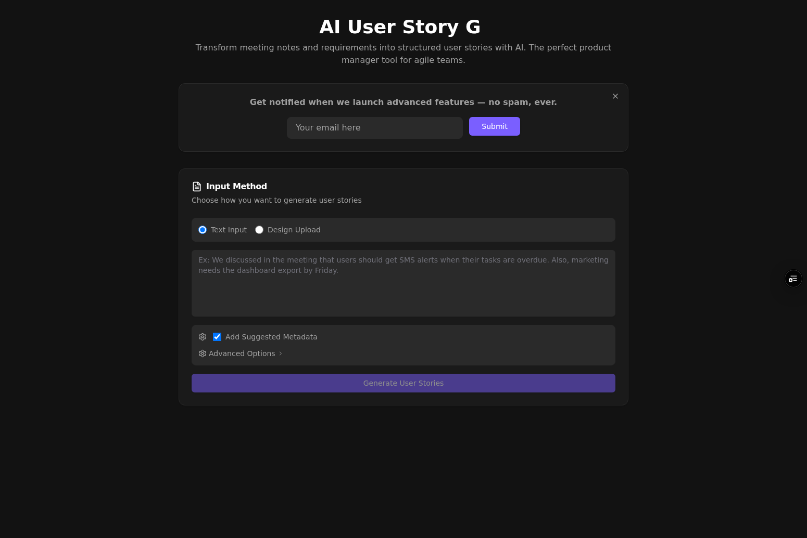

# 🚀 Prompt2Story

> **Transform meeting notes and requirements into structured user stories with AI**  
> The perfect product manager tool for agile teams.

[](https://surfrrosa-git-devin-1754832907-5c631a-shainas-projects-adbfd2be.vercel.app/)
[](LICENSE)
[](https://github.com/Surfrrosa/prompt2story)



## ✨ Features

### 🎯 **Dual Input Modes**
- **📝 Text Analysis**: Convert meeting notes, requirements documents, or bug reports into structured user stories
- **🎨 Design Analysis**: Upload design files (PNG, JPG, PDF) to generate user stories for UI components and workflows

### 🤖 **AI-Powered Generation**
- **GPT-4o Integration**: Uses OpenAI's most advanced model with specialized prompts
- **Structured Output**: Consistent format with title, story, and acceptance criteria
- **Smart Metadata**: Optional priority, effort estimation, and persona assignment
- **Edge Case Detection**: Identifies unusual scenarios and edge cases automatically

### 🔧 **Advanced Configuration**
- **Metadata Enhancement**: Add priority levels, effort estimates, and user personas
- **Advanced Criteria**: Generate 5-7 detailed acceptance criteria per story
- **Component Expansion**: Comprehensive analysis of all UI elements in designs
- **Gherkin Format**: "Given/When/Then" structure for acceptance criteria

### 📤 **Export Options**
- **Multiple Formats**: JSON, Markdown, or copy to clipboard
- **Project Management Ready**: Direct integration with tools like Jira, Azure DevOps
- **Feedback System**: Rate and regenerate individual stories
- **Interactive Results**: Expandable metadata and detailed story cards

## 🎯 Use Cases

**Perfect for:**
- 👥 **Product Managers** converting meeting notes to actionable stories
- 🎨 **UX Designers** translating mockups into development requirements  
- 📋 **Business Analysts** structuring informal requirements
- 🏃‍♂️ **Agile Teams** streamlining story creation workflows
- 🔄 **DevOps Teams** converting bug reports to structured tasks

## 🚀 Quick Start

### Prerequisites

- **Node.js** 18+ ([Download](https://nodejs.org/))
- **Python** 3.12+ ([Download](https://python.org/))
- **Poetry** ([Installation Guide](https://python-poetry.org/docs/#installation))
- **OpenAI API Key** ([Get yours here](https://platform.openai.com/api-keys))

### 🔧 Backend Setup

```bash
# Navigate to backend directory
cd backend

# Install dependencies
poetry install

# Set up environment variables
cp .env.example .env

# Add your OpenAI API key to .env
echo "OPENAI_API_KEY=your-api-key-here" >> .env

# Start the development server
poetry run uvicorn app.main:app --host 0.0.0.0 --port 8000 --reload

# Or use the new dev script
poetry run dev
```

## 🚀 Quick Setup (Automated)

For first-time setup, use the automated setup script:

```bash
./setup.sh
```

This will:
- Copy environment files from examples
- Install all dependencies
- Provide clear next steps

## 📋 Development Startup Checklist

Before starting development, ensure:

1. ✅ Backend .env file configured with OPENAI_API_KEY
2. ✅ Backend server running: `cd backend && poetry run dev`
3. ✅ Frontend server running: `cd frontend && npm run dev`
4. ✅ Health check passes: `curl http://localhost:8000/healthz`

### 🎨 Frontend Setup

```bash
# Navigate to frontend directory  
cd frontend

# Install dependencies
npm install

# Set up environment variables
cp .env.example .env

# Start the development server
npm run dev
```

🎉 **That's it!** Open [http://localhost:3000](http://localhost:3000) to start generating user stories.

## 📖 Usage Examples

### Text Analysis Mode

**Input:**
```
We discussed in the meeting that users should get SMS alerts when their tasks are overdue. 
Also, marketing needs the dashboard export by Friday.
```

**Generated Output:**
```
📋 User Story: SMS Task Overdue Notifications
As a task owner, I want to receive SMS alerts when my tasks become overdue 
so that I can take immediate action to complete them.

✅ Acceptance Criteria:
- Given a task has passed its due date, when the system checks for overdue tasks, then an SMS alert should be sent to the task owner
- Given a user receives an SMS alert, when they click the link in the message, then they should be directed to the specific overdue task
- Given a task is marked as complete, when the system processes the update, then no further SMS alerts should be sent for that task
```

### Design Analysis Mode

Upload design mockups (PNG, JPG, PDF) and get comprehensive user stories for:
- 🔘 Interactive UI components (buttons, forms, modals)
- 📱 User workflows and navigation paths  
- 🎨 Visual elements and layout requirements
- 🔄 State changes and user interactions

## 🛠️ API Documentation

### Core Endpoints

| Endpoint | Method | Description |
|----------|--------|-------------|
| `/generate-user-stories` | POST | Convert text input to user stories |
| `/analyze-design` | POST | Process uploaded design files |
| `/regenerate-story` | POST | Generate new version of specific story |
| `/submit-feedback` | POST | Collect user ratings and comments |
| `/healthz` | GET | Health check endpoint |

### Example API Usage

```bash
# Generate user stories from text
curl -X POST "http://localhost:8000/generate-user-stories" \
  -H "Content-Type: application/json" \
  -d '{
    "text": "Users need to login with email and password",
    "include_metadata": true,
    "infer_edge_cases": true
  }'
```

## 🔧 Configuration

### Environment Variables

#### Backend (`.env`)
```bash
# Required: OpenAI API key for story generation
OPENAI_API_KEY=sk-proj-your-openai-api-key-here
```

#### Frontend (`.env`)
```bash
# Backend API URL (defaults to localhost for development)
VITE_API_URL=http://localhost:8000
```

### Advanced Options

- **`include_metadata`**: Add priority, effort, and persona data
- **`infer_edge_cases`**: Generate edge case scenarios  
- **`include_advanced_criteria`**: Create 5-7 detailed acceptance criteria
- **`expand_all_components`**: Analyze all UI elements in designs

## 🚀 Deployment

### Frontend (Vercel)
```bash
# Build the frontend
npm run build

# Deploy to Vercel
vercel --prod
```

### Backend (Fly.io)
```bash
# Deploy to Fly.io
fly deploy
```

### Environment Setup
Update deployment URLs in:
- `.github/workflows/ops.yml`: CI/CD workflows
- `ops/` scripts: Health checks and monitoring

## 🧪 Testing

### Run Backend Tests
```bash
cd backend
poetry run pytest
```

### Run Frontend Tests  
```bash
cd frontend
npm test
```

### Manual Testing Checklist
- [ ] Text input generates valid user stories
- [ ] Design upload processes files correctly
- [ ] Metadata options work as expected
- [ ] Export functionality works in all formats
- [ ] Feedback system captures ratings
- [ ] Regeneration produces different results

## 🐛 Troubleshooting

### Common Issues

**Backend won't start:**
```bash
# Check Python version
python --version  # Should be 3.12+

# Reinstall dependencies
poetry install --no-cache
```

**Frontend build fails:**
```bash
# Clear node modules and reinstall
rm -rf node_modules package-lock.json
npm install
```

**API key errors:**
- Verify your OpenAI API key is valid and has credits
- Check the key is properly set in `backend/.env`
- Ensure no extra spaces or quotes around the key

**CORS issues:**
- Verify `VITE_API_URL` points to the correct backend URL
- Check backend is running on the expected port (8000)

### Getting Help

- 🐛 [Report bugs](https://github.com/Surfrrosa/prompt2story/issues)
- 💬 [Ask questions](https://github.com/Surfrrosa/prompt2story/discussions)
- 📧 [Contact support](mailto:support@prompt2story.com)

## 🤝 Contributing

We welcome contributions! Here's how to get started:

1. **Fork the repository**
2. **Create a feature branch**: `git checkout -b feature/amazing-feature`
3. **Make your changes** and add tests
4. **Run the test suite**: `npm test && poetry run pytest`
5. **Commit your changes**: `git commit -m 'Add amazing feature'`
6. **Push to the branch**: `git push origin feature/amazing-feature`
7. **Open a Pull Request**

### Development Guidelines

- Follow existing code style and patterns
- Add tests for new functionality
- Update documentation for API changes
- Use conventional commit messages
- Ensure all CI checks pass

## 📋 Roadmap

### 🎯 Upcoming Features
- [ ] **Batch Processing**: Upload multiple files at once
- [ ] **Template Library**: Pre-built story templates for common scenarios
- [ ] **Integration APIs**: Direct export to Jira, Azure DevOps, GitHub Issues
- [ ] **Team Collaboration**: Share and collaborate on story sets
- [ ] **Custom Prompts**: User-defined prompt templates
- [ ] **Analytics Dashboard**: Track story generation metrics

### 🔮 Future Vision
- [ ] **Multi-language Support**: Generate stories in different languages
- [ ] **Voice Input**: Convert meeting recordings to user stories
- [ ] **Smart Suggestions**: AI-powered story improvement recommendations
- [ ] **Enterprise Features**: SSO, audit logs, advanced permissions

## 🏆 Acknowledgments

- **OpenAI** for providing the GPT-4o API that powers our story generation
- **Vercel** for seamless frontend deployment and hosting
- **Fly.io** for reliable backend infrastructure
- **The Open Source Community** for the amazing tools and libraries that make this possible

## 📄 License

This project is licensed under the MIT License - see the [LICENSE](LICENSE) file for details.

## 🔒 Security

For security guidelines and best practices, see [SECURITY.md](SECURITY.md).

To report security vulnerabilities, please email [security@prompt2story.com](mailto:security@prompt2story.com).

---

<div align="center">

**Made with ❤️ by [@Surfrrosa](https://github.com/Surfrrosa)**

[⭐ Star this repo](https://github.com/Surfrrosa/prompt2story) • [🐛 Report Bug](https://github.com/Surfrrosa/prompt2story/issues) • [✨ Request Feature](https://github.com/Surfrrosa/prompt2story/issues)

</div>
